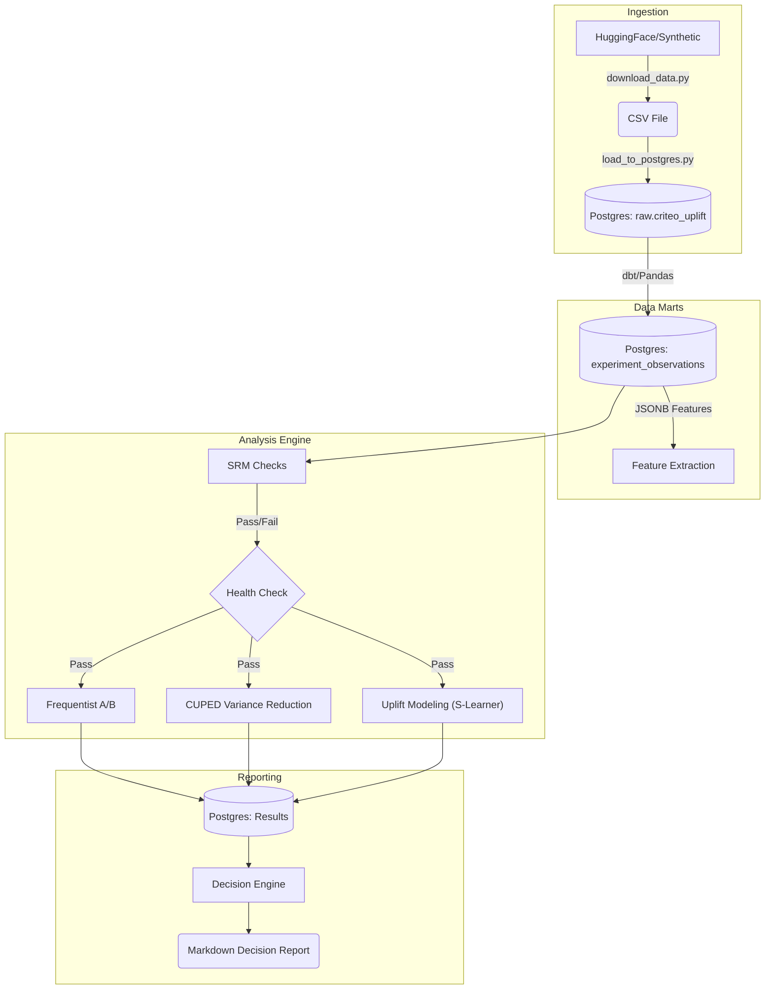

# Experimentation & Incrementality Platform


A production-grade platform meant to solve the "Last Mile" problem in experimentation: moving from simple A/B tests to **targeted interventions** using Uplift Modeling.

This project demonstrates how to build an end-to-end causal inference engine that not only measures *average* treatment effects (ATE) but identifies *heterogeneous* treatment effects (HTE) to optimize marketing spend.

---

## 🎯 Business Problem
Marketing teams often waste budget on:
1.  **Sure Things**: Users who would convert anyway.
2.  **Lost Causes**: Users who will never convert.
3.  **Sleeping Dogs**: Users who react *negatively* to marketing.

**Goal**: Identify the **Persuadables**—users who convert *only if* treated—and target them specifically.

## 🔬 Scientific Methodology

This platform implements a rigorous statistical pipeline:

### 1. Data Quality & Trust (SRM)
Before any analysis, we run **Sample Ratio Mismatch (SRM)** checks (Chi-Square test) to ensure the assignment mechanism was random.
- *Status*: 🛑 If p < 0.001, the pipeline halts automatically.

### 2. Variance Reduction (CUPED)
We allow for faster experiments by using **CUPED (Controlled-Experiment Using Pre-Experiment Data)**.
- *Method*: We extract pre-experiment user features (`f0`..`f11`) and use OLS regression to reduce metric variance.
- *Impact*: Increases effective sample size, allowing for significant results with fewer users.

### 3. Uplift Modeling (Causal Inference)
We go beyond A/B testing to estimating Individual Treatment Effects (ITE) using **S-Learners** and **Class Transformation** approaches.
- *Evaluation*: We use **Qini Curves** (Area Under Uplift Curve) to validate the model's ability to rank users by incremental gain.
- *Policy*: The system simulates a targeting policy (e.g., "Target Top 30%") to estimate expected ROI lift.

---

## 🏗 System Architecture

The platform follows a modern Data Engineering lifecycle, orchestrated by **Dagster**:



---

## 📊 Key Results (Demo)

On the **Criteo Uplift V2** dataset (synthetic sample), the platform successfully:
1.  **Detected Signal**: Found a statistically significant Average Treatment Effect (ATE) of **+2.3%** conversion lift.
2.  **Optimized Targeting**: The **S-Learner Uplift Model** identified a segment (Top 30%) with an expected lift of **+5.5%**, effectively **doubling the efficiency** of the campaign compared to random targeting.

---

## 🚀 Getting Started

### Prerequisites
- Docker & Docker Compose
- Python 3.10+

### Quick Start
1.  **Clone & Install**
    ```bash
    git clone https://github.com/kaushikkumarkr/experimentation-platform.git
    cd experimentation-platform
    make setup    # copy .env
    make install  # pip install dependencies
    ```

2.  **Start Infrastructure**
    ```bash
    make up       # start Postgres & Superset
    ```

3.  **Run Pipeline (Dagster)**
    ```bash
    make dagster-dev
    ```
    Access the UI at [http://localhost:3000](http://localhost:3000). Click **"Materialize All"** to verify the results.

### Project Structure
- `analysis/`: Core statistical logic (the "Brain").
- `orchestration/`: Dagster assets defining the DAG.
- `db/`: Database schemas.
- `reports/`: Auto-generated decision reports.

---

## 📈 Dashboarding
Operational dashboards are available in **Apache Superset** (localhost:8088).
- **Default Creds**: `admin` / `admin`

---
*Built with Python, Scikit-Uplift, Statsmodels, and Dagster.*
