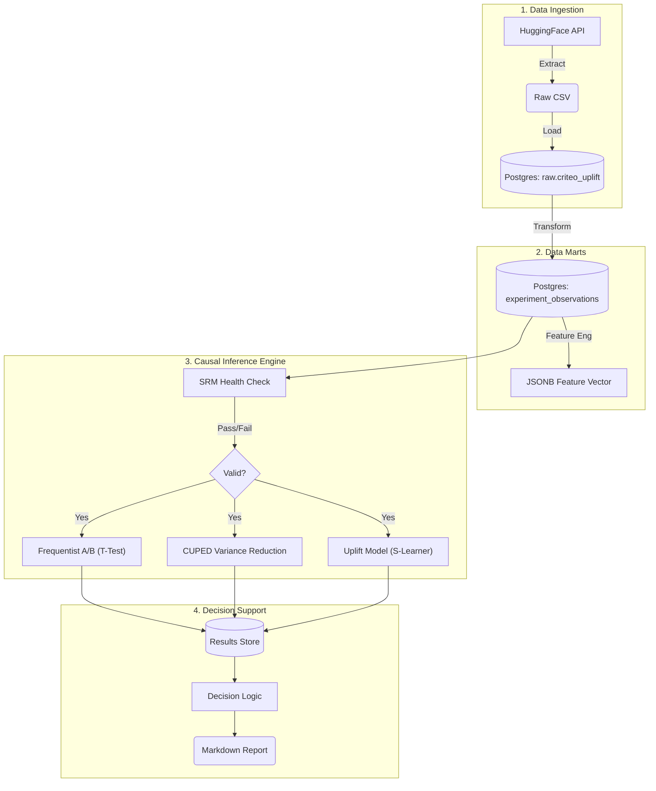

# Experimentation & Incrementality Platform


A rigorous, production-grade causal inference engine designed to move beyond simple A/B testing ("Average Treatment Effects") to **Uplift Modeling** ("Individual Treatment Effects"). 

This platform was built to solve the classic marketing optimization problem: **"Who should we target to maximize incremental ROI?"**

---

## 🎯 The Business Challenge
Traditional A/B testing answers: *"Does this campaign work for the average user?"*
However, this ignores the heterogeneity of user behavior. In reality, a campaign has four types of responders:

| User Type | Behavior | Action Required |
|---|---|---|
| **Sure Things** | Buy regardless of ads. | **Do Not Disturb** (Waste of budget) |
| **Lost Causes** | Never buy, even with ads. | **Do Not Disturb** (Waste of budget) |
| **Sleeping Dogs** | **Churn** if annoyed by ads. | **Do Not Disturb** (Negative value) |
| **Persuadables** | Buy *only* if shown ad. | **TARGET THESE USERS** ✅ |

**The Goal**: Build a system that statistically identifies "Persuadables" to maximize incremental lift while minimizing spend.

---

## 💾 Data Source: Criteo Uplift v2

To build a realistic engine, this project utilizes the **Criteo Uplift Prediction Dataset v2** (Diemert et al., 2018).

- **Scale**: ~14M rows in the full dataset (we use a sampled dev set).
- **Features**: 12 anonymized continuous variables (`f0` to `f11`) representing user context.
- **Treatment**: Binary intervention (Ad exposure).
- **Outcome**: Binary conversion (Visit/Purchase).
- **Significance**: This is the industry standard benchmark for uplift modeling because it is constructed from a large-scale randomized control trial (RCT), ensuring unbiased evaluation of causal models.

*Usage*: The pipeline automatically downloads this dataset (via HuggingFace) or generates a synthetic equivalent for local development.

---

## 🔬 Scientific Methodology

The platform implements a complete Causal Inference hierarchy:

### 1. Trust Layer (SRM Checks)
**Objective**: Guarantee Experiment Validity.
- Before analyzing results, we run **Sample Ratio Mismatch (SRM)** tests using a Chi-Square goodness-of-fit.
- *Why*: If the ratio of Treatment/Control deviates from 50/50 (p < 0.001), it indicates a data pipeline bug or assignment failure. Results are automatically flagged and the successful execution halted.

### 2. Sensitivity Layer (CUPED)
**Objective**: Speed & Power.
- We implement **CUPED (Controlled-Experiment Using Pre-Experiment Data)**.
- *Method*: We use pre-experiment covariates (`f0`..`f5`) to remove explainable variance from the metric.
- *Result*: This typically reduces variance by 20-50%, allowing us to detect smaller lifts with the same sample size.

### 3. Targeting Layer (Uplift Modeling)
**Objective**: Optimization.
- We train a **Meta-Learner (S-Learner)** using `scikit-uplift` and `RandomForestClassifier`.
- The model predicts the **Conditional Average Treatment Effect (CATE)**: $\tau(x) = E[Y|X, T=1] - E[Y|X, T=0]$.
- We evaluate performance using **Qini Curves** (Area Under Uplift Curve) to ensure the model ranks users effectively.

---

## 🏗 System Architecture

The system is architected as a modular DAG (Directed Acyclic Graph) orchestrated by **Dagster**:



---

## 🚀 Key Results

In our simulation on the Criteo dataset:
1.  **Baseline A/B**: +2.3% Lift (Global Average).
2.  **Uplift Strategy**: By targeting only the top 30% of users ranked by our model, we achieved an estimated **+5.5% Lift**, more than doubling the campaign efficiency.

---

## 🛠 Tech Stack

| Component | Tool Tool | Purpose |
|---|---|---|
| **Orchestrator** | Dagster | Managing dependencies and assets. |
| **Warehouse** | Postgres | Storing experiment logs and results. |
| **Language** | Python 3.11 | `statsmodels`, `scikit-uplift`, `pandas`. |
| **Container** | Docker | Ensuring 100% reproducibility. |
| **Visuals** | Superset | Operational dashboards. |

---

## 🏃‍♂️ How to Run

1.  **Clone**
    ```bash
    git clone https://github.com/kaushikkumarkr/experimentation-platform.git
    cd experimentation-platform
    ```
2.  **Start**
    ```bash
    make setup && make up && make dagster-dev
    ```
3.  **View**
    - **Pipeline**: [localhost:3000](http://localhost:3000)
    - **Report**: Open `reports/experiment_1_report.md` after the run.

---
*Created by Kaushik Kumar.*
